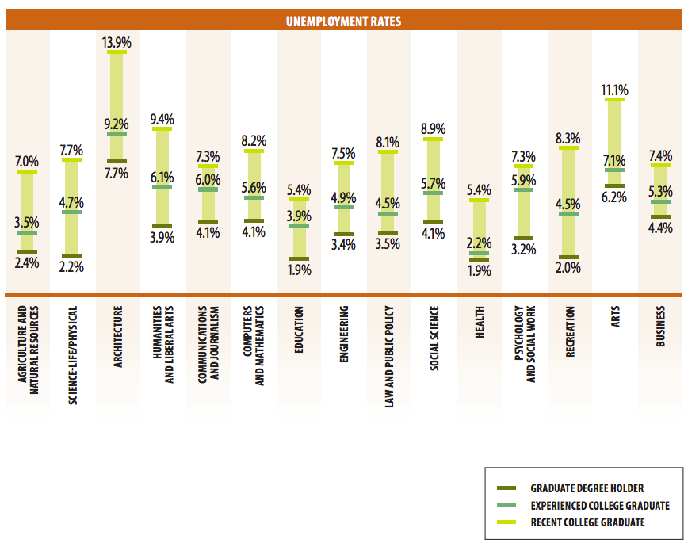
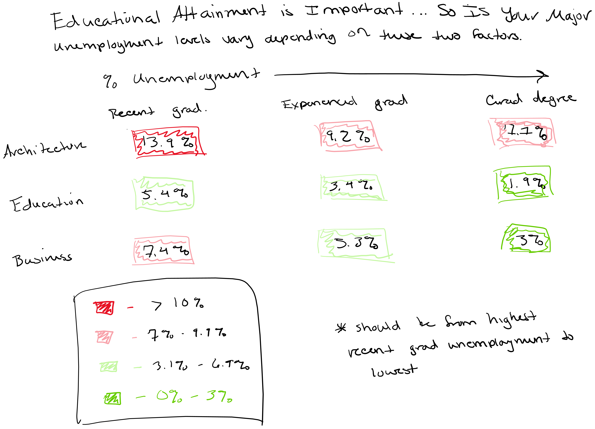

# Assignment 3 & 4: Critique By Design

## Step 1: Find a Data Visualization

Arguments have been made in recent years for and against liberal arts education. On one hand, some argue that having a liberal arts education improves job marketability as students come away with improved [critical thinking, analytic, and writing skills](https://www.newgeography.com/content/003564-the-value-a-liberal-arts-education-landing-a-job). On the other hand, some have argued that it is more important for universities to offer programs directly related to the needs of the current market. 

This data and visualization, taken from Georgetown University's Center on Education and the Workforce ["Hard Times: College Majors, Unemployment, and Earnings" report](https://cew.georgetown.edu/cew-reports/hard-times-2012/#resources), argues that different college majors, along with the level of education achieved, are correlated with higher or lower unemployment rates. Some [conclusions](https://www.slideshare.net/CEWGeorgetown/hard-times-college-majors-unemployment-and-earnings-not-all-college-degrees-are-created-equal-54178784) are reached including statements such as, "unemployment is lowest where the ties between majors and occupation are the highest" and "graduate degrees can help boost earning potential."

However, their visualization of this unemployment data could use some work.

I chose this particular visualization for a couple of reasons. First, the content is interesting to me as someone who has spent a great deal of time in education - as a student and as a teacher - and as someone who strongly supports liberal arts education because I believe it creates more well-rounded individuals. Secondly, I think this visualization has some problems, from the lack of clarity, to the color choices, to the decisions about labels. I wanted the opportunity to analyze what it is that I don't like about this visualization and create a new visualization that clearly conveys the data in the way the it was originally intended. 

## Step 2: Critique the Visualization

### Thoughts on the Visualization
The first thing I noticed about this visualization was that it looked like it was trying to compare box and whisker plots, which didn’t make sense based on the title of the chart. Upon further inspection, I realized that the “box” was simply taking up space along an unseen axis of values and each “whisker” indicated a different unemployment value for a different level of education. That first impression, and the following realization of what the visual was actually trying to show stood out to me and made me choose this as an ineffective visualization that I wanted to redesign. 

In general, I don’t like hardly anything about this visual. The only thing they really do well is make the percentage labels and key clear and easy to read. Other than that, there are a lot of things that don’t work well for me. First, the title is completely uninformative. Simply calling the graph “Unemployment Rates” could mean anything – unemployment rates where and for what? Second, the color palette is pretty bad, specifically the choice of colors for the levels of educational attainment highlighted in the key in relation to the overall orange color of the larger graph. The “recent college graduate” lines being the same color as the box is confusing visually as it seems that line is part of the box, not a value indicator. I also dislike that the names of the various college majors along the x axis are written sideways. I understand this was probably a choice to save space, but it’s hard to read and no one wants to have to strain their neck to read the axis labels. Finally, the alternating-colored backgrounds to show the delineation between each college major is completely unnecessary and just adds clutter rather than serving any useful purpose. 

If I were able to change this visual, I would do the following:
-	Change the visualization to not look like box and whisker plots but create something more intuitive.
-	Add a title that clearly defines what the visualization is showing which is unemployment rates by college major based on varying levels of educational attainment.
-	Create axis labels that are easy to read and tell the audience what they’re looking at – the percentage labels shouldn’t be necessary if you have a y axis label. 
-	Redo the color scheme to be more pleasing and remove the needless background colors that ultimately take away attention from the actual data.

### Thoughts on Intended Audience
I think the audience is intended to be those in academia, potentially higher education professionals and future and current students, to show that different college majors have better or worse unemployment rates and that there is a correlation between higher levels of educational attainment and lower unemployment rates. However, I’m not sure that this visualization is effective in reaching that audience.

By definition of the audience I have identified, I would be included in that audience, and I simply didn’t get it on first glance. I also showed it to my partner, who also had to look at it for a while before understanding what it was trying to show. While the actual message, once decoded, is pretty clear to see but the visualization is not clear in presenting it. The lack of a y axis and the seemingly random order in which the majors are listed makes the visualization appear jumbled. You can clearly see the one outlier, Architecture, but beyond that, there isn’t a clear point. Am I supposed to be warned off certain majors? Is the point to reassure people that graduate school is the best way to not be unemployed? Is this really a recruitment tool masked as a visualization to attract more graduate student enrollment (potentially, yes – the visualization was originally created by people at Georgetown University)? 

I would think that the intended audience, as I identified, would want to see a visualization that is clean, easy to read, and quickly shows the trends in unemployment rates between differing majors and levels of educational attainment. This visualization doesn’t accomplish those goals, so I don’t believe it is effective in reaching its intended audience nor does it make its purpose particularly clear.

*Answers taken from the Data Visualization Effectiveness Profile Critique submitted via Google Forms*

## Step 3: Wireframe a Solution 

The following images represent my thought process in wireframing my solutions for this visualization. I started with brainstorming and ultimately ended with the idea of creating a heat map table to show the severity of unemployment at different educational levels while simultaneaously comparing unemployment levels across different college majors. 

## Step 4: Test the Solution

## Step 5: Build a Solution

<noscript></noscript><object class='tableauViz'  style='display:none;'><param name='host_url' value='https%3A%2F%2Fpublic.tableau.com%2F' /> <param name='embed_code_version' value='3' /> <param name='site_root' value='' /><param name='name' value='CollegeMajorUnemployment&#47;Sheet1' /><param name='tabs' value='no' /><param name='toolbar' value='yes' /><param name='static_image' value='https:&#47;&#47;public.tableau.com&#47;static&#47;images&#47;Co&#47;CollegeMajorUnemployment&#47;Sheet1&#47;1.png' /> <param name='animate_transition' value='yes' /><param name='display_static_image' value='yes' /><param name='display_spinner' value='yes' /><param name='display_overlay' value='yes' /><param name='display_count' value='yes' /><param name='language' value='en-US' /><param name='filter' value='publish=yes' /></object>
                

