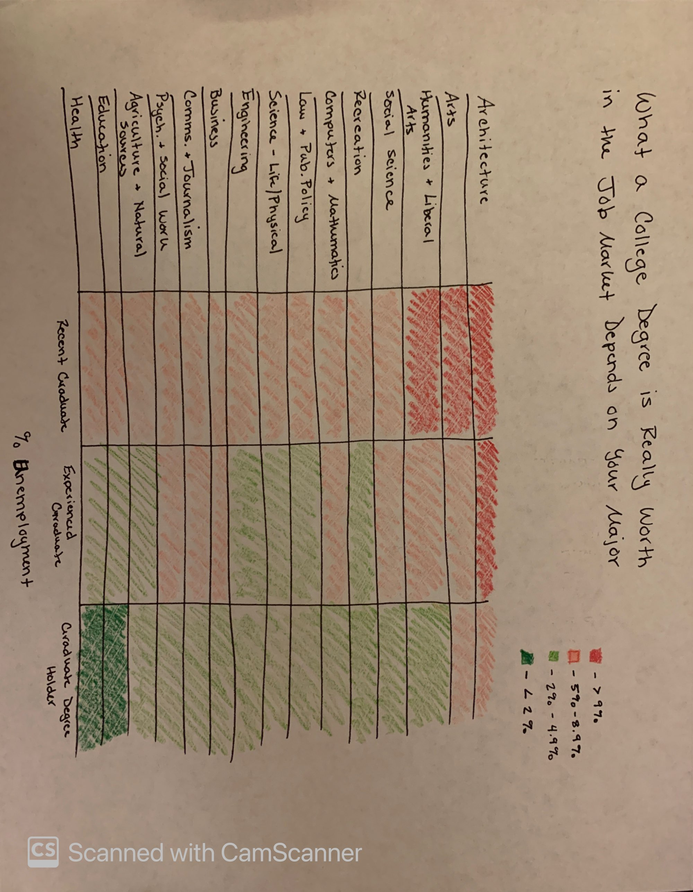
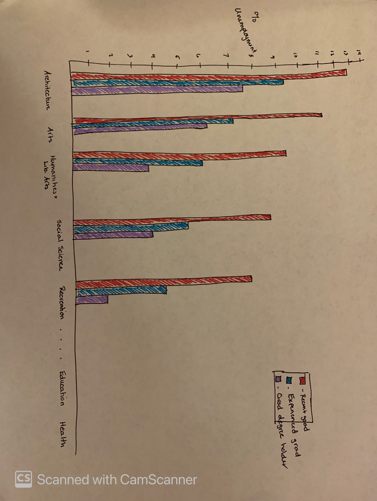

# Assignment 3 & 4: Critique By Design

## Step 1: Find a Data Visualization

Arguments have been made in recent years for and against liberal arts education. On one hand, some argue that having a liberal arts education improves job marketability as students come away with improved [critical thinking, analytic, and writing skills](https://www.newgeography.com/content/003564-the-value-a-liberal-arts-education-landing-a-job). On the other hand, some have argued that it is more important for universities to offer programs directly related to the needs of the current market. 

This data and visualization, taken from Georgetown University's Center on Education and the Workforce ["Hard Times: College Majors, Unemployment, and Earnings" report](https://cew.georgetown.edu/cew-reports/hard-times-2012/#resources), argues that different college majors, along with the level of education achieved, are correlated with higher or lower unemployment rates. Some [conclusions](https://www.slideshare.net/CEWGeorgetown/hard-times-college-majors-unemployment-and-earnings-not-all-college-degrees-are-created-equal-54178784) are reached including statements such as, "unemployment is lowest where the ties between majors and occupation are the highest" and "graduate degrees can help boost earning potential."

However, their visualization of this unemployment data could use some work.

I chose this particular visualization for a couple of reasons. First, the content is interesting to me as someone who has spent a great deal of time in education - as a student and as a teacher - and as someone who strongly supports liberal arts education because I believe it creates more well-rounded individuals. Secondly, I think this visualization has some problems, from the lack of clarity, to the color choices, to the decisions about labels. I wanted the opportunity to analyze what it is that I don't like about this visualization and create a new visualization that clearly conveys the data in the way the it was originally intended. 

## Step 2: Critique the Visualization

### Thoughts on the Visualization
The first thing I noticed about this visualization was that it looked like it was trying to compare box and whisker plots, which didn’t make sense based on the title of the chart. Upon further inspection, I realized that the “box” was simply taking up space along an unseen axis of values and each “whisker” indicated a different unemployment value for a different level of education. That first impression, and the following realization of what the visual was actually trying to show stood out to me and made me choose this as an ineffective visualization that I wanted to redesign. 

In general, I don’t like hardly anything about this visual. The only thing they really do well is make the percentage labels and key clear and easy to read. Other than that, there are a lot of things that don’t work well for me. First, the title is completely uninformative. Simply calling the graph “Unemployment Rates” could mean anything – unemployment rates where and for what? Second, the color palette is pretty bad, specifically the choice of colors for the levels of educational attainment highlighted in the key in relation to the overall orange color of the larger graph. The “recent college graduate” lines being the same color as the box is confusing visually as it seems that line is part of the box, not a value indicator. I also dislike that the names of the various college majors along the x axis are written sideways. I understand this was probably a choice to save space, but it’s hard to read and no one wants to have to strain their neck to read the axis labels. Finally, the alternating-colored backgrounds to show the delineation between each college major is completely unnecessary and just adds clutter rather than serving any useful purpose. 

If I were able to change this visual, I would do the following:
-	Change the visualization to not look like box and whisker plots but create something more intuitive.
-	Add a title that clearly defines what the visualization is showing which is unemployment rates by college major based on varying levels of educational attainment.
-	Create axis labels that are easy to read and tell the audience what they’re looking at – the percentage labels shouldn’t be necessary if you have a y axis label. 
-	Redo the color scheme to be more pleasing and remove the needless background colors that ultimately take away attention from the actual data.

### Thoughts on Intended Audience
I think the audience is intended to be those in academia, potentially higher education professionals and future and current students, to show that different college majors have better or worse unemployment rates and that there is a correlation between higher levels of educational attainment and lower unemployment rates. However, I’m not sure that this visualization is effective in reaching that audience.

By definition of the audience I have identified, I would be included in that audience, and I simply didn’t get it on first glance. I also showed it to my partner, who also had to look at it for a while before understanding what it was trying to show. While the actual message, once decoded, is pretty clear to see but the visualization is not clear in presenting it. The lack of a y axis and the seemingly random order in which the majors are listed makes the visualization appear jumbled. You can clearly see the one outlier, Architecture, but beyond that, there isn’t a clear point. Am I supposed to be warned off certain majors? Is the point to reassure people that graduate school is the best way to not be unemployed? Is this really a recruitment tool masked as a visualization to attract more graduate student enrollment (potentially, yes – the visualization was originally created by people at Georgetown University)? 

I would think that the intended audience, as I identified, would want to see a visualization that is clean, easy to read, and quickly shows the trends in unemployment rates between differing majors and levels of educational attainment. This visualization doesn’t accomplish those goals, so I don’t believe it is effective in reaching its intended audience nor does it make its purpose particularly clear.

*Answers taken from the Data Visualization Effectiveness Profile Critique submitted via Google Forms*

## Step 3: Wireframe a Solution 

The following images represent my thought process in wireframing my solutions for this visualization. I started with brainstorming and I eventually ended up thinking a table would be a clean way to show the percentage data, and then I could possibly color code each box. Ultimately, I ended with the idea of creating a heat map table to show the severity of unemployment at different educational levels while simultaneaously comparing unemployment levels across different college majors

After brainstorming, I initially came up with the following heat map prototype.

Upon receiving some feedback, I drew a second prototype sketch, this time envisioning the data in a grouped bar chart format.

## Step 4: Test the Solution

The feeback I received for my initial sketch prompted me to do a second sketch of a visualization, which ultimately ended up being less popular, so I reverted to utilizing a version of my first sketch. The process I went through to obtain feedback follows:

Questions: *What do you see? What do you think this is showing? Who do you think would find this useful and why? What would you change, if anything?*

Respondant 1: 
"It categorizes stuff."; "These are unemployment rates for each major. Architecture is the worst option and not worth my money. Oh, I see there are categories - a couple years of education and graduate degree are the best options."; "I'd use different colors. I can't really see the differentiation between the two greens and the two reds. It isn't quick to understand with the colors. I might also add the actual percentages, not just colors."; "This would be good for a high school grad deciding on college majors. Wait, I take that back; maybe someone deciding now after already being out of school for a while."

Respondant 2: 
"I like it!"; "Wait, nevermind this is confusing."; "The title makes no sense and I think salary when I read it. It's also not as clear as it should be - would a high schooler look at this and understand it quickly?"; "I don't see the comparisons between degrees as much as I would with a grouped bar chart. I like that idea better; I thnk it's easier to read."

At this point, I had two different views of my initial drawing, so I drew the grouped bar chart (pictured above) and asked for a second opinion from Respondant 2 as well as opinions from two more respondants. 

Respondant 2 (cont.):
"I like the group bar chart much better. To me, this is way easier to read and understand quickly. I think it's clearer."

Respondant 3:
*referring to the heat map*
"I'd change the colors to be less Christmas-y; maybe use variations of one color to show change. I'd also put the majors in a different order. Maybe alphabetical or something."; "The category labels aren't super clear for 'Experienced grad' and 'Degree holder.' I would change those to be more clear. I'd also maybe put 'percent unemployment' in the title to fix the title clarity issue."

*referring to the bar chart*
"The bar chart would have too many categories across the x-axis. I like the heat map better. The comparisons are more clear and it doesn't look as overwhelming as the bar chart."

Respondant 4:
"I prefer the heat map; it's easier to compare the majors because they're closer together."; "I'd also change the title because it makes me think I'd see salary ranges, not unemployment rates. And I would come up with clearer educational category labels."

Looking at all of this feedback, I decided the heat map was the easiest for most of the respondants to understand and helped them make comparisons more clearly across categories. As far as changes, I needed to change the colors, and create a clearer title and educational category labels. For audience, there seemed to be agreement that it would reach the intended audience reasonably well since it was easier to read and interpret in a heat map format. These were the things I kept in mind as I worked on designing my final visualization. 

## Step 5: Build a Solution

Below is the finished redesign of the original "Unemployment Rates" chart showing unemployment rates across two variables - college major and level of educational attainment. 

<noscript></noscript><object class='tableauViz'  style='display:none;'><param name='host_url' value='https%3A%2F%2Fpublic.tableau.com%2F' /> <param name='embed_code_version' value='3' /> <param name='site_root' value='' /><param name='name' value='CollegeMajorUnemployment&#47;Sheet1' /><param name='tabs' value='no' /><param name='toolbar' value='yes' /><param name='static_image' value='https:&#47;&#47;public.tableau.com&#47;static&#47;images&#47;Co&#47;CollegeMajorUnemployment&#47;Sheet1&#47;1.png' /> <param name='animate_transition' value='yes' /><param name='display_static_image' value='yes' /><param name='display_spinner' value='yes' /><param name='display_overlay' value='yes' /><param name='display_count' value='yes' /><param name='language' value='en-US' /><param name='filter' value='publish=yes' /></object>
                

Source: Georgetown University Center on Education and the Workforce, [Original Website Link](https://www.newgeography.com/content/003564-the-value-a-liberal-arts-education-landing-a-job)

I initially chose this visualization because the original was so poorly designed. The title, labels, color choices, and format were unclear and didn't make it easy to even determine what the point of the visual was. In creating my redesigned visualization I tried to, first and foremost, fix the lack of clarity so that it could be read easily by my audiences. By creating the above heat map, I believe I have solved those issues. 

First, the title is much clearer and speaks to the multiple variables that the chart shows as having a correlation with unemployment rates. Second, I made the labels clearer by renaming "Experienced Graduate" to "Graduates with Work Experience" and "Graduate Degree Holder" to "Graduate Level Degree Holder." I also made sure that the college major labels were listed horizontally, rather than vertically as seen in the original vizualization, making it much easier to read. Third, and most importantly, I changed the format of the graphic to a heat map. 

Based on user feedback and my own brainstorming, I believe the heat map table of data makes it easy to quickly see trends regarding high versus low unemployment levels related to both college major and educational level. It's easy to look at the coloration on this map and see that the top left corner, Archictect majors right out of college, have the highest unemployment rates while Education majors with a graduate level degree have the lowest rate of unemployment. This is also related to my choice of color, as orange, a warm color, indicates a worse unemploymnet rate than blue, a cool color. Based on natural associations with color, this adds another layer of clarity as viewers will likely view the organge as more negative color and will view the cool as a more calm, "good" color. Although I think there could be more definition in the shades of blue throughout the middle percentages, I think the overall trend is still clear and the viewer could easily see the actual percentage rates in addition to the color to add context. 

Additionally, I chose this chart type so the rows and columns would be close enough together to easily compare across majors. One can compare Architecture and Education, on opposite ends of the chart, as easily as Architecture and Arts which are right next to each other. That is one of the greatest strengths of this visualization that I wasn't able to replicate with a different type of chart, such as a grouped bar chart, as it spread the infomration out too much to make comparions.

Overall, I feel that this visualization is much stronger than the original in terms of clarity, and is also much more pleasing aesthetically.
